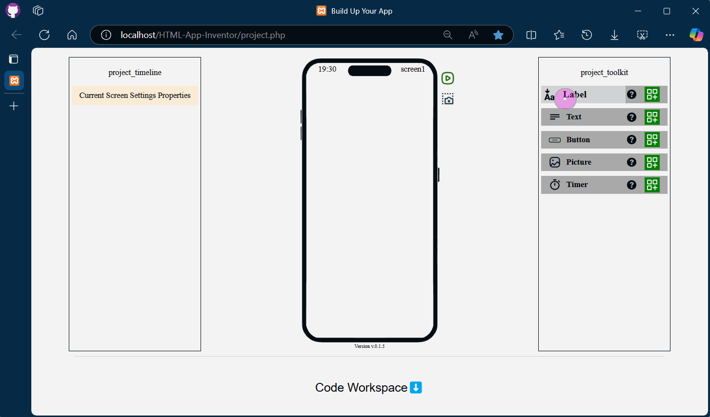
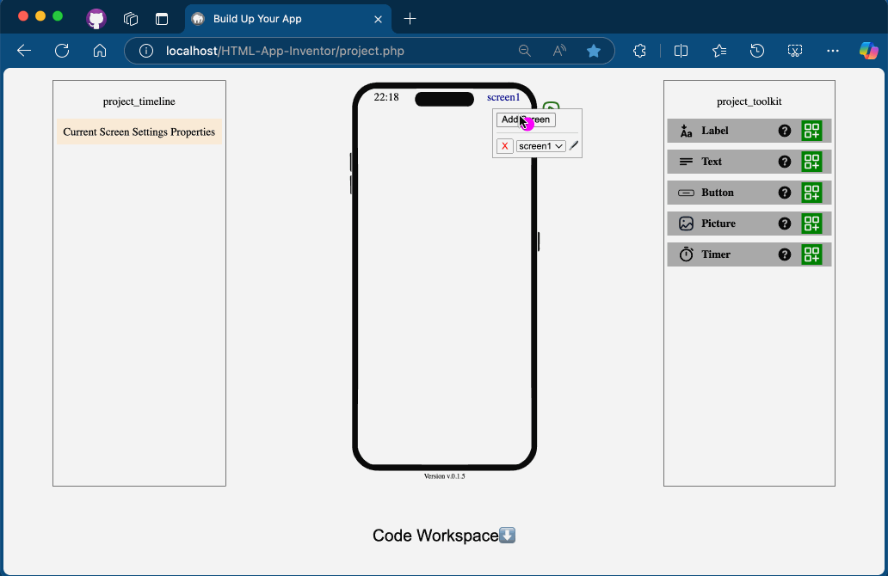
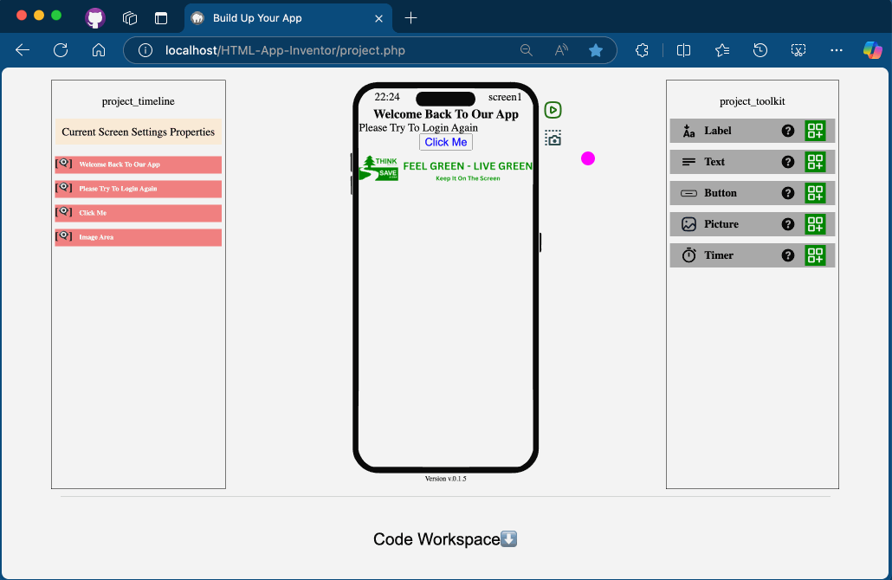

# HTML App Inventor

Without any worries you can just start drag and drop to build your first application without any required experiences.

## How it works ⁉️

Modern technology leverages HTML to create straightforward projects with minimal effort. This project takes it a step further, making the process even simpler and more accessible for anyone to use.

## Contains tools that can help plan your app⚙️

**Drag And Drop**

Everything start's with your mouse movements...

**More Customizations**

Change everything can came to your mind...

**Your Code, Your Workspace**

Start crafting actions, so you know what result you'll get.

**Multi Screens Means Multi Interfaces**

No matter what your app will do, we feel your needs.

**Share a snap to your friends?**

Single Click With Shortcut (ALT + S) gets you a screenshot !

### What's New 🆕

Fully compatible with all modern browsers.

### COOMING SOON ⏰

Store Custom Variables